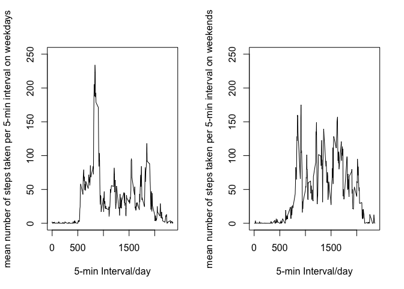

# Reproducible Research: Peer Assessment 1

### Data pre-processing
Load the data.

```r
activity <- read.csv("./activity.csv")
```
Explore the data.

```r
summary(activity)
```

```
##      steps                date          interval     
##  Min.   :  0.00   2012-10-01:  288   Min.   :   0.0  
##  1st Qu.:  0.00   2012-10-02:  288   1st Qu.: 588.8  
##  Median :  0.00   2012-10-03:  288   Median :1177.5  
##  Mean   : 37.38   2012-10-04:  288   Mean   :1177.5  
##  3rd Qu.: 12.00   2012-10-05:  288   3rd Qu.:1766.2  
##  Max.   :806.00   2012-10-06:  288   Max.   :2355.0  
##  NA's   :2304     (Other)   :15840
```

```r
str(activity)
```

```
## 'data.frame':	17568 obs. of  3 variables:
##  $ steps   : int  NA NA NA NA NA NA NA NA NA NA ...
##  $ date    : Factor w/ 61 levels "2012-10-01","2012-10-02",..: 1 1 1 1 1 1 1 1 1 1 ...
##  $ interval: int  0 5 10 15 20 25 30 35 40 45 ...
```

```r
head(activity)
```

```
##   steps       date interval
## 1    NA 2012-10-01        0
## 2    NA 2012-10-01        5
## 3    NA 2012-10-01       10
## 4    NA 2012-10-01       15
## 5    NA 2012-10-01       20
## 6    NA 2012-10-01       25
```
Count number of records with missing data.

```r
sum(is.na(activity$steps))
```

```
## [1] 2304
```

Calculate the total number of steps taken per day.

```r
DailyTotalSteps <- tapply(activity$steps, activity$date, sum)
```
Visualize the trend.

```r
p <- barplot(DailyTotalSteps, xlab="Date", ylab="total number of steps taken per day")
```


Calculate and report the mean and median of the total number of steps taken per day.

```r
mean(DailyTotalSteps, na.rm=TRUE); median(DailyTotalSteps, na.rm=TRUE)
```

```
## [1] 10766.19
```

```
## [1] 10765
```
The mean total number of steps per day is 10,766, whereas the median is 10,765.

Compute the average number of steps for every interval across Oct. and Nov.

```r
meanStepsByInterval <- tapply(activity$steps, activity$interval, na.rm = TRUE, mean)
```
Visualize the trend.

```r
g <- plot(meanStepsByInterval ~ names(meanStepsByInterval), type = "l", xlab="5-min Interval/day", ylab="mean number of steps taken per 5-min interval")
```


Check when the average number of steps peaks.

```r
peakElement <- which.max(meanStepsByInterval)
names(meanStepsByInterval)[peakElement]
```

```
## [1] "835"
```
The step activities peak at 8:35 am in the morning.

### Imputing missing values

Note that there are a number of days/intervals where there are missing values (coded as 𝙽𝙰). The presence of missing days may introduce bias into some calculations or summaries of the data.

1. Calculate and report the total number of missing values in the dataset. (i.e. the total number of rows with 𝙽𝙰.s)


```r
sum(is.na(activity$steps))
```

```
## [1] 2304
```
The total number of missing values in the dataset is 2304.

2. Devise a strategy for filling in all of the missing values in the dataset. The strategy does not need to be sophisticated. For example, you could use the mean/median for that day, or the mean for that 5-minute interval, etc.

- Find rows with NA value in steps and fill it with the mean step value of the corresponding interval value.

3. Create a new dataset that is equal to the original dataset but with the missing data filled in.

```r
newActivity <- activity
rowNA <- which(is.na(newActivity$steps))
for (i in rowNA) {
    interval_val <- as.character(newActivity$interval[i])
    newActivity$steps[i] <- meanStepsByInterval[names(meanStepsByInterval)==interval_val]
}
```

4. Make a histogram of the total number of steps taken each day and Calculate and report the mean and median total number of steps taken per day. Do these values differ from the estimates from the first part of the assignment? What is the impact of imputing missing data on the estimates of the total daily number of steps?

```r
par(mfrow=c(1,2))
p <- barplot(DailyTotalSteps, xlab="Date", ylab="total number of steps taken per day, with missing values")
newDailyTotalSteps <- tapply(newActivity$steps, newActivity$date, sum)
p <- barplot(newDailyTotalSteps, xlab="Date", ylab="total number of steps taken per day, with imputed values")
```


Calculate and report the mean and median total number of steps taken per day.

```r
mean(DailyTotalSteps, na.rm=TRUE); median(DailyTotalSteps, na.rm=TRUE)
```

```
## [1] 10766.19
```

```
## [1] 10765
```

```r
mean(newDailyTotalSteps); median(newDailyTotalSteps)
```

```
## [1] 10766.19
```

```
## [1] 10766.19
```
- For original activity data, the mean total number of steps per day is 10,766, whereas the median is 10,765.
- For imputed activity data, the mean total number of steps per day is 10,766, whereas the median is 10,766.

Because we fill the missing step value with the mean daily activity steps, whose mean is 10,766, the mean of imputed data is not changed. Whereas the median is increased, because more step data are added and thus shifting the 50% population upwards.

### Are there differences in activity patterns between weekdays and weekends?
Subset activity data by weekdays or weekends.

**Note**: 周六 and 周日 are Saturday and Sunday in Chinese, respectively.

```r
activityWeekend <- data.frame()
activityWeekday <- data.frame()
for (i in 1:nrow(activity)) {
    if (weekdays(as.Date(activity$date[i])) %in% c("周六", "周日")) {
        activityWeekend <- rbind(activityWeekend, activity[i,])
    } else {
        activityWeekday <- rbind(activityWeekday, activity[i,])
    }
}
```
Compute weekday and weekend means.

```r
meanStepsByIntervalWeekday <- tapply(activityWeekday$steps, activityWeekday$interval, na.rm = TRUE, mean)
meanStepsByIntervalWeekend <- tapply(activityWeekend$steps, activityWeekend$interval, na.rm = TRUE, mean)
```
Plot the weekday and weekend trends, with identical y scales.

```r
par(mfrow=c(1,2))
g <- plot(meanStepsByIntervalWeekday ~ names(meanStepsByIntervalWeekday), ylim=c(0,250), type = "l", xlab="5-min Interval/day", ylab="mean number of steps taken per 5-min interval on weekdays")
g <- plot(meanStepsByIntervalWeekend ~ names(meanStepsByIntervalWeekend), ylim=c(0,250), type = "l", xlab="5-min Interval/day", ylab="mean number of steps taken per 5-min interval on weekends")
```



Check when average number of steps peaks.

```r
peakElementWeekday <- which.max(meanStepsByIntervalWeekday)
peakIntervalWeekday <- names(meanStepsByIntervalWeekday)[peakElementWeekday]
peakElementWeekend <- which.max(meanStepsByIntervalWeekend)
peakIntervalWeekend <- names(meanStepsByIntervalWeekend)[peakElementWeekend]
peakIntervalWeekday; peakIntervalWeekend
```

```
## [1] "835"
```

```
## [1] "915"
```
Weekend activities are more frequent, with less number of steps. They peak at 9:15 am, later than weekday activity peak at 8:35 am. 
